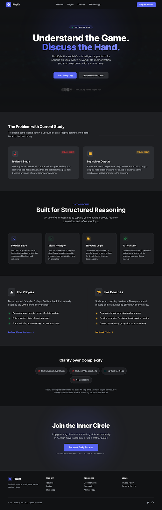

# FlopIQ

**The social-first poker hand intelligence platform.**



## What is FlopIQ?

FlopIQ is a poker learning platform built around **discussion, storytelling, and shared interpretation of hands**. Unlike traditional solvers and GTO tools that provide static answers, FlopIQ focuses on *how humans actually learn poker*: through comparison, explanation, disagreement, and pattern recognition.

> "Poker is not learned in silence. The biggest breakthroughs come from explaining your thinking to someone else — or realizing you can't."

### Core Features

- **Hand Replay** — Watch hands unfold street by street with full context
- **Threaded Discussions** — Comments tied to exact decision nodes, not floating in chat
- **Player Profiles** — Public (opt-in) profiles with hand histories and reputation
- **Coach Tools** — Create puzzles, assign hands, review student annotations
- **AI Assistant** — Get feedback on potential logic gaps, powered by poker theory models

## What FlopIQ is NOT

This distinction is critical to the product vision:

- ❌ **Not a solver replacement** — We don't compete with PioSolver, GTO Wizard, or commercial solvers
- ❌ **Not a "click here for the right answer" app** — We teach reasoning, not rote memorization
- ❌ **Not a solver arms-race product** — Accuracy and speed are not our battleground

FlopIQ complements solvers by focusing on **interpretation, explanation, social proof, and teaching**.

## Who is this for?

### Players

Serious recreational players who want to improve but are overwhelmed by solvers. Semi-professional players who currently review hands via Discord, Skype, or WhatsApp.

- Document your thought process for later review
- Build a trusted circle of study partners
- Track leaks in your reasoning, not just your stats

### Coaches

Poker coaches who need a scalable way to teach reasoning, not just answers.

- Create custom puzzles from real hands
- Assign hands to students and review their annotations
- Build libraries of teaching examples
- Share public content as marketing

## Tech Stack

This is a static landing page with zero build dependencies:

| Technology | Purpose |
|------------|---------|
| HTML | Page structure |
| [Tailwind CSS](https://tailwindcss.com/) (CDN) | Styling with Discord-inspired dark theme |
| [Google Fonts](https://fonts.google.com/) | Inter + JetBrains Mono typography |
| [Material Symbols](https://fonts.google.com/icons) | Iconography |

## Local Development

No build step required. Simply open the file in your browser:

```bash
# Clone the repository
git clone <repository-url>
cd stitch_flopiq_landing_page

# Open in browser (macOS)
open index.html

# Or on Linux
xdg-open index.html

# Or just drag index.html into your browser
```

For live reload during development, use any static file server:

```bash
# Using Python
python3 -m http.server 8000

# Using Node.js (npx)
npx serve .
```

## Project Structure

```
stitch_flopiq_landing_page/
├── index.html    # Complete landing page
├── screen.png    # Landing page screenshot
└── README.md     # This file
```

## Strategic Context

This landing page implements the positioning defined in the FlopIQ PR/FAQ:

- **Social is the operating system**, not an add-on
- **Discussion is the product**, not a feature
- **Clarity beats optionality** — we commit to the social-first fork

The product competes with chaos (Discord, forums, fragmented screenshots) by providing structure and norms — not with solvers by providing precision.

## Contributing

1. Fork the repository
2. Create a feature branch (`git checkout -b feature/amazing-feature`)
3. Commit your changes (`git commit -m 'Add amazing feature'`)
4. Push to the branch (`git push origin feature/amazing-feature`)
5. Open a Pull Request

## Author

**stan** — Amsterdam, NL

---

*FlopIQ: Understand the Game. Discuss the Hand.*

